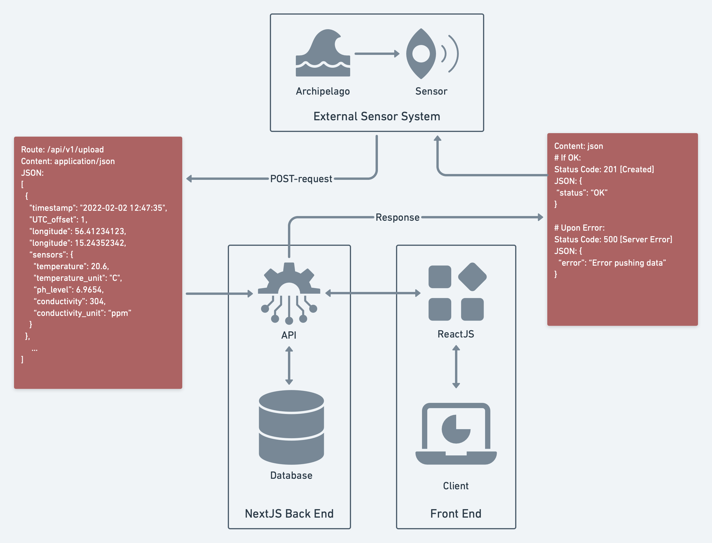

[](https://opensource.org/licenses/MIT)
[](https://github.com/sensor-network/open-data-portal/actions/workflows/integrate.yml)

# open-data-portal

## Table of Contents
- [Introduction](#introduction)
- [Architecture Overview](#architecture-overview)
- [How to Use](#how-to-use)
  * [Using Docker](#using-docker)
    + [Prerequisites](#prerequisites)
    + [Build](#build)
    + [Run](#run)
  * [From source](#from-source)
    + [Prerequisites](#prerequisites-1)
    + [Initial setup](#initial-setup)
    + [Build](#build-1)
    + [Test](#test)
      - [Mutation tests](#mutation-tests)
    + [Run](#run-1)
    + [Load database](#load-database)
- [License](#license)

## Introduction

An Open Source, Full Stack Application for storing, distributing and visualising Water Measurements around the Karlskrona Archipelago.
Its main purpose is its integration of the sister repo [Sensor Collector](https://github.com/sensor-network/sensor-collector) where different water measurements are measured and sent over HTTP to the API.

Built using:
- [Next.js](https://nextjs.org) for backend, including a REST API
- [React](https://beta.reactjs.org) for frontend
- [Swagger](https://swagger.io) for API Documentation
- MySQL (with its [Node package](https://github.com/mysqljs/mysql)) for database
packaged using [Docker](https://www.docker.com) containers.

Other dependencies worth mentioning are:
- [React Leaflet](https://react-leaflet.js.org) for Open Street Map integration
- [Recharts](https://recharts.org/en-US/) for Visualizations.
- Styled using [MUI](https://mui.com)

## Architecture Overview

The diagram shows the different parts of the system and how they interact with each other. The external sensor system
can be found [here](https://github.com/sensor-network/sensor-collector).



## How to Use

This application can be built and run in two ways:

### Using Docker
__Packaged with a mySQL database__
#### Prerequisites

- [Docker](https://docker.com)
- [Docker Compose](https://docs.docker.com/compose/)

#### Build

If you want to build the application image yourself, you can

1. Clone the repo:

```bash
$ git clone https://github.com/sensor-network/open-data-portal.git
$ cd open-data-portal
```

2. Build a local image:

```bash
$ docker compose build app
```

#### Run

You can now run the application using Docker Compose. If you build the image locally, it will use the local image.
Otherwise, it will pull the latest version from the registry.

```bash
$ docker compose up
```

The application will then start at `localhost:3000`

### From source

#### Prerequisites

- [Node.js 12.22.0](https://nodejs.org/en/) or later

#### Initial setup

1. Clone the repo:

```bash
$ git clone https://github.com/sensor-network/open-data-portal.git
$ cd open-data-portal
```

2. Install the project's dependencies:

```bash
# Using npm
$ npm i
# Using pnpm
$ pnpm i
# Using yarn
$ yarn i
```

3. Verify the credentials in `.env`. By default, it contains the credentials used to connect to the dockerized database
   supplied in this repo.

#### Build

Build an optimized production version of the app:

```bash
# Using npm
$ npm run build
# Using pnpm
$ pnpm build
# Using yarn
$ yarn build
```

#### Test

Run all tests:

```bash
# Using npm
$ npm test
# Using pnpm
$ pnpm test
# Using yarn
$ yarn test
```

Tests can also be run in `watch`-mode while developing to have them re-run each compilation by adding `:test` to the command.

##### Mutation tests

You can also run mutation tests using [Stryker](https://stryker-mutator.io/docs/stryker-js/introduction).

**NOTE: Currently Stryker is not compatible with Next.js/Jest by default. The workaround is to use Babel by renaming [babelrc.js](babelrc.js) to `.babelrc.js`.**

```sh
$ stryker run

// Mutation tests takes time. Report from last time:
INFO MutationTestExecutor Done in 58 minutes 45 seconds.
```

#### Run

Run developer version with fast refresh:

```bash
# Using npm
$ npm run dev
# Using pnpm
$ pnpm dev
# Using yarn
$ yarn dev
```

Or start a built production version:

```bash
# Using npm
$ npm run start
# Using pnpm
$ pnpm start
# Using yarn
$ yarn start
```

In case you dont have a database running, you can also run a containerized database to go along with the application
using

```bash
$ docker compose up db
```

The default credentials for this database can be found in [docker-compose.yml](./docker-compose.yml)

Then open the app in the browser at the link shown in your terminal.

#### Load database

When you first launch the application, the database will be empty. We have included a load-script which loads in random,
although somewhat realistic data which can be executed using

```bash
# Using npm
$ npm run fill-db
# Using pnpm
$ pnpm fill-db
# Using yarn
$ yarn fill-db
```

It will automatically create the sensors if they dont exist, and fill the database with random data from these sensors.
Alternatively, you can modify the config to specify existing sensors/location (see [here](docs/README.md) how to do
that) by changing the configuration object in [fill-db.ts](./scripts/fill-db.ts):

```js
const c = {
  /* define time range of when to insert measurements */
  START_TIME: new Date("2022-01-01Z"),
  END_TIME: new Date("2023Z"),

  /* select time interval between measurements (seconds) */
  DATA_DENSITY: 30 * 60,

  /* define what sensors are sending the data */
  TEMPERATURE_SENSOR_ID: 1,
  PH_SENSOR_ID: 3,
  CONDUCTIVITY_SENSOR_ID: 2,

  /* specify the coordinates which the measurement is coming from. */
  LOCATION: {
    LAT: 56.182469,
    LONG: 15.589325,
  },

  /* define ranges for measurements (in SI-units) */
  MIN_TEMP: 283,
  MAX_TEMP: 298,
  MIN_COND: 3,
  MAX_COND: 8,
  MIN_PH: 4,
  MAX_PH: 9,

  /* define how much each datapoint is allowed to change between each point,
   * the rate is a randomized value between -<change_rate> < 0 < <change_rate> */
  TEMP_CHANGE_RATE: 0.1,
  COND_CHANGE_RATE: 0.1,
  PH_CHANGE_RATE: 0.1,

  /* define timeout between inserts (ms) */
  TIMEOUT: 5000,
};
```

Let the script run for however long you like, or until it has filled the time-range.

## License

Copyright (c) 2022 Julius Marminge, André Varga, Arlind Iseni, Majed Fakhr Eldin, Nils Persson Suorra

This work (source code) is licensed under [MIT](./LICENSES/MIT.txt).

Files other than source code are licensed as follows:

- Documentation and screenshots are licensed under [CC BY-SA 4.0](./LICENSES/CC-BY-SA-4.0.txt).

See the [LICENSES](LICENSES) folder in the root of this project for license details.
